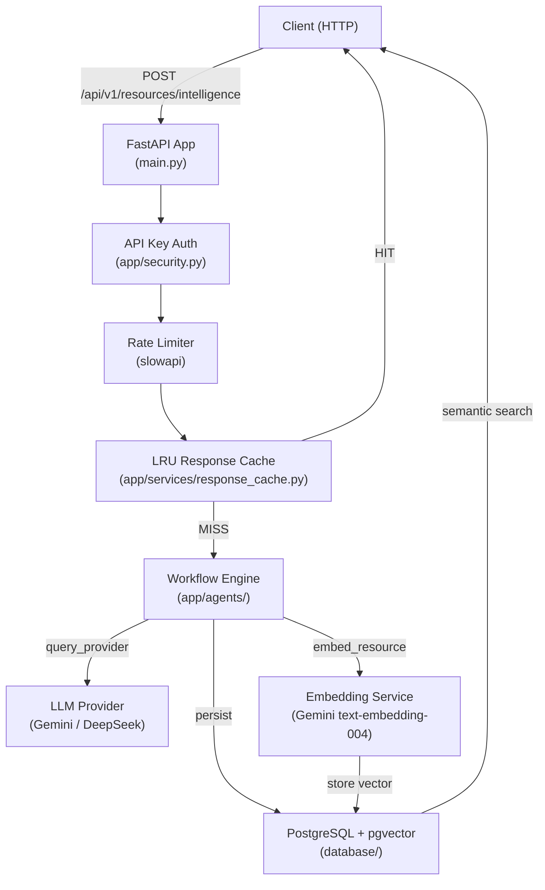

# ISML AI AGENT — System Architecture

## Overview

ISML AI AGENT is a FastAPI-based AI service that discovers, evaluates, ranks, and persists educational resources for any learning topic. A single API request triggers a complete multi-stage LangGraph workflow that ends with a structured JSON response, database persistence, and pgvector embeddings for semantic search.

---

## Component Diagram



---

## Request Flow

1. **Request received** — `RequestLoggingMiddleware` assigns a `correlation_id` and logs method + path.
2. **Security** — `verify_api_key` dependency checks `X-API-Key` header (configurable; disabled by default for local dev).
3. **Rate limiting** — slowapi limits requests per minute on expensive endpoints (configurable via `RATE_LIMIT_PER_MINUTE`).
4. **Cache check** — `LRUResponseCache` checked before running the pipeline. On cache HIT the response returns immediately.
5. **Workflow execution** — `execute_workflow()` runs the LangGraph node loop to completion.
6. **Database persistence** — `DatabasePersistenceService.persist()` stores all results automatically.
7. **Response** — Structured dict returned; cached if valid.

---

## Workflow Stages

| Phase | Node | Purpose |
|---|---|---|
| INITIALIZE | `initialize_node` | Validate required input fields |
| TOPIC_ANALYSIS | `topic_analysis_node` | Extract learning context (objectives, skills) |
| KNOWLEDGE_RETRIEVAL | `knowledge_retrieval_node` | Check DB for existing high-quality resources |
| SEARCH_STRATEGY | `search_strategy_node` | Generate deduplicated search query variations |
| DISCOVER_RESOURCES | `discover_resources_node` | Multi-source parallel discovery (4 source types) |
| EVALUATE_RESOURCES | `evaluate_resources_node` | Validate → normalize → deduplicate → score |
| RANK_RESOURCES | `rank_resources_node` | Composite ranking + categorization + learning sequence |
| BUILD_PROMPT | `build_prompt_node` | Construct system + task prompt (with repair fragment if needed) |
| QUERY_PROVIDER | `query_provider_node` | Call LLM provider with retry + exponential backoff |
| PARSE_RESPONSE | `parse_response_node` | Extract JSON from LLM text + strip markdown fences |
| VALIDATE_OUTPUT | `validate_output_node` | Pydantic schema validation + repair-retry on failure |
| COMPLETE | `complete_node` | Log final state |

**Knowledge retrieval shortcut:** When `KNOWLEDGE_RETRIEVAL_MIN_RESOURCES` or more high-quality resources exist in the DB, the workflow jumps directly from KNOWLEDGE_RETRIEVAL to EVALUATE_RESOURCES, skipping search, discovery, and the LLM call entirely.

---

## Database Schema

| Table | Purpose |
|---|---|
| `domains` | Top-level subject domains |
| `courses` | Courses within a domain |
| `topics` | Learning topics with difficulty level |
| `resources` | Discovered educational resources + lifecycle status |
| `resource_evaluations` | 20-dimension quality scores per resource |
| `resource_embeddings` | 768-dim pgvector vectors (Gemini text-embedding-004) |
| `search_queries` | Logged search queries per workflow run |
| `workflow_runs` | Full observability record per API invocation |

### Resource Lifecycle States (ENH-010)

```
DISCOVERED → VALIDATED → EVALUATED → APPROVED
                                   ↓
                              REJECTED / ARCHIVED / UNAVAILABLE
```

Rejected, archived, and unavailable resources are excluded from knowledge retrieval and semantic search results.

---

## LLM Provider Architecture

All LLM providers implement `BaseLLMProvider` (ABC):

```python
class BaseLLMProvider(ABC):
    async def generate_text(self, prompt: str, model: str = "") -> dict: ...
```

Concrete implementations: `GeminiService`, `DeepSeekService`. Switch provider by setting `provider` in the API request. Add new providers by implementing the interface and adding a case to `LLMProviderFactory`.

**Retry strategy:** `@async_retry(LLM_RETRY_CONFIG)` — 3 attempts, 2s base, 30s max, 2× exponential backoff, ±25% jitter. Auth errors (401/403/400) are not retried.

---

## Evaluation and Scoring

`ResourceScoringEngine` produces a `ComprehensiveResourceScore` with 4 dimensions, all on a 0–1 scale:

| Dimension | Weight | Sub-scores |
|---|---|---|
| Relevance | 30% | topic_match, keyword_match, objective_coverage, difficulty_alignment |
| Educational Quality | 30% | accuracy, pedagogy, engagement, comprehensiveness, clarity, interactivity |
| Credibility | 25% | authority, reputation, expertise, peer_review, currency |
| Learning Effectiveness | 15% | skill_dev, retention, practical, motivation, assessment_compat |

**Quality tiers** (configurable via env vars, 0–1 scale):

| Tier | Default Threshold | Auto-Approve |
|---|---|---|
| Excellent | ≥ 0.90 | Yes |
| High Quality | ≥ 0.80 | Yes |
| Acceptable | ≥ 0.70 | Yes |
| Review | < 0.70 | No |

---

## Embedding and Semantic Search

- **Model:** Gemini `text-embedding-004` (768 dimensions)
- **Index:** HNSW with `vector_cosine_ops` (m=16, ef_construction=64) created in `init_db()`
- **Search:** pgvector cosine distance via `EmbeddingRepository.find_similar()`
- **Batching:** All embeddings for a workflow run are generated in parallel with `asyncio.gather()`

---

## Security Architecture

| Control | Implementation |
|---|---|
| API authentication | `verify_api_key` FastAPI dependency; `X-API-Key` header; disabled by default |
| Rate limiting | slowapi; `RATE_LIMIT_PER_MINUTE` env var (default 20/min) |
| SSRF protection | `normalize_url()` blocks localhost, loopback, private/link-local IPs, non-HTTP schemes |
| CORS | Configurable via `CORS_ORIGINS` env var; defaults to `*` for development |
| Secret management | All secrets via env vars / `.env` file; never hardcoded; never logged |
| Error safety | `generic_exception_handler` catches all unhandled exceptions; no stack traces in responses |

---

## Observability

Every workflow run produces a `WorkflowRun` DB record with:

- `duration_ms` — total request duration
- `resources_discovered / validated / evaluated / ranked / persisted / embeddings_generated`
- `retry_count` — number of LLM retries
- `knowledge_retrieved` — whether DB cache was used
- `llm_prompt_tokens / completion_tokens / total_tokens` — from provider response
- `messages` — structured workflow log
- `errors` — validation and error list

Structured JSON logs (one per line) are written to `logs/app.log`. Each log line includes `correlation_id`, `timestamp`, `level`, `logger`, and `message`.

---

## Failure Handling

| Failure | Behavior |
|---|---|
| Missing required input field | Workflow terminates at INITIALIZE with error |
| Invalid/private/malformed URL | Resource rejected at EVALUATE_RESOURCES with logged reason |
| Duplicate URL (within run) | Skipped silently after normalization |
| LLM returns invalid JSON | Retry up to `max_retries` with re-prompt |
| LLM output fails schema validation | Repair prompt appended; retry up to `max_retries` |
| LLM provider error (503, etc.) | `async_retry` retries 3× with exponential backoff |
| DB unavailable at startup | Warning logged; app continues without DB |
| DB unavailable at persist time | Logged; API response still returned |
| Embedding API failure | Logged and skipped; resource stored without embedding |
| Single resource scoring error | Logged and skipped; other resources continue |

---

## Configuration Reference

All settings are in `app/config.py` and read from environment variables.

| Variable | Default | Purpose |
|---|---|---|
| `API_KEY_ENABLED` | `false` | Enable API key authentication |
| `API_KEY` | — | Expected API key value |
| `RATE_LIMIT_PER_MINUTE` | `20` | Max requests/minute on LLM endpoints |
| `CORS_ORIGINS` | `*` | Allowed CORS origins (comma-separated) |
| `KNOWLEDGE_RETRIEVAL_MIN_RESOURCES` | `5` | Min existing resources to skip discovery |
| `KNOWLEDGE_RETRIEVAL_MIN_SCORE` | `0.65` | Min composite score to count as high-quality |
| `QUALITY_THRESHOLD_EXCELLENT` | `0.90` | Score ≥ this → Excellent tier |
| `QUALITY_THRESHOLD_HIGH` | `0.80` | Score ≥ this → High Quality tier |
| `QUALITY_THRESHOLD_ACCEPTABLE` | `0.70` | Score ≥ this → Acceptable tier |
| `RESPONSE_CACHE_MAX_SIZE` | `128` | LRU cache entries (0 = disabled) |
| `DATABASE_URL` | local postgres | PostgreSQL connection string |
| `GEMINI_API_KEY` | — | Gemini API key |
| `DEEPSEEK_API_KEY` | — | DeepSeek API key |
